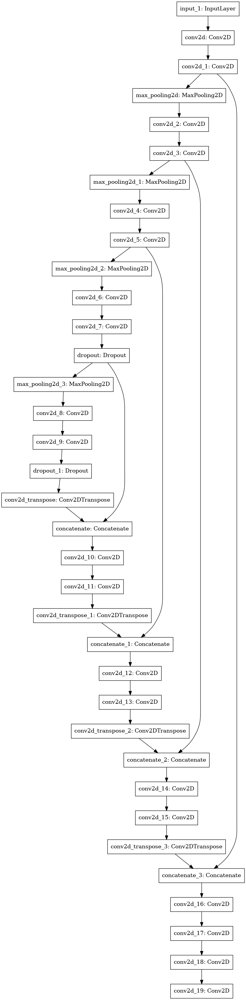

# Image-Segmentation-UNET
Semantic image segmentation is the name for this type of image classification. By identifying each pixel in an image with its appropriate class, semantic image segmentation allows us to anticipate an exact mask for each item in the picture. The term "semantic" relates to what is being represented; for example, a dark blue mask may represent the "Car" class, whereas the a red mask indicates "Person" class. 

## DataSet
The daaset is available at https://robotcar-dataset.robots.ox.ac.uk/datasets/. This Dataset has 9000 images and the Ground Truth Mask images for training

## Result
Model accieved 95% accuracy on Validation and Test DataSet. Examples of model predictions is provided below:

